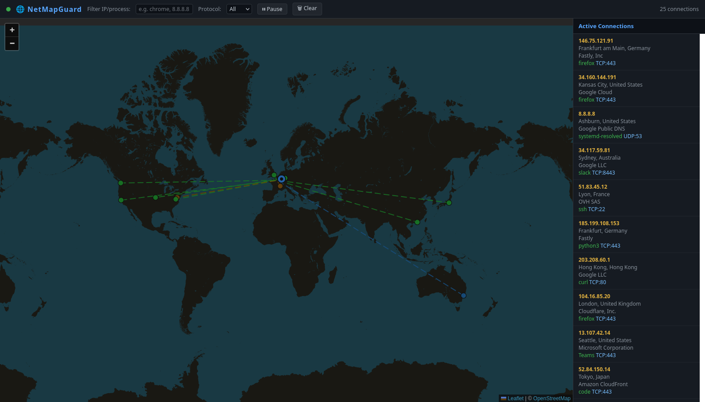

# NetMapGuard 🌐

**Real-time network traffic visualiser on a world map.**



When you run NetMapGuard, it opens a web interface showing:

- 📍 **Your machine** as a blue dot on the map.
- 🔴 **Remote endpoints** as coloured dots (green = standard web port, yellow = other well-known port, blue = ephemeral).
- ⚡ **Animated beams** (dashed lines) connecting your machine to every active remote connection — beams *appear* when a connection is established and *fade out* when it goes idle or closes.
- 📋 **Live connection list** in the sidebar with remote IP, geo-location, organisation, and process name.
- 🔍 **Filters** by text (IP, process, city, org) and protocol (TCP/UDP).
- ⏸ **Pause / resume** and 🗑 **clear** controls.

---

## Requirements

Downloading a [release executable](#installation--launch) needs nothing but the OS itself. Running from source needs:

| Dependency | Purpose |
|---|---|
| Python ≥ 3.10 | Runtime |
| `psutil` | Cross-platform connection polling (no root required) |
| `fastapi` + `uvicorn` | Async web server + WebSocket |
| `requests` | IP geolocation via [ip-api.com](http://ip-api.com) (free, no key needed) |

---

## Installation & launch

The simplest way to use NetMapGuard is to download the ready-made executable for your OS — no Python, no terminal commands, nothing to install. Grab it from the **[Releases page](https://github.com/Estemobs/NetMapGuard/releases/latest)**.

In every case, once it starts, NetMapGuard automatically opens the map **in your default browser** — you don't need to type an address yourself. If the browser doesn't pop up for some reason, the address to open manually (e.g. `http://127.0.0.1:8888`) is printed on the first line of output.

### 🪟 Windows

1. Download `netmapguard-windows-x86_64.exe`.
2. Double-click it.
3. A console window opens (that's normal — it shows the live logs) and, a moment later, your browser opens the map. **Keep the console window open** while you use NetMapGuard; closing it stops the app.

> Windows SmartScreen may warn about an "unrecognised app" the first time — click **More info → Run anyway** (the binary isn't code-signed).

### 🍎 macOS

1. Download `netmapguard-macos-arm64`.
2. Open a terminal in the download folder and make it executable **once**:
   ```bash
   chmod +x netmapguard-macos-arm64
   ```
3. Double-click the file in Finder (or run `./netmapguard-macos-arm64` in the terminal). Your browser opens the map automatically.

> Gatekeeper will likely block the first launch ("cannot be opened because the developer cannot be verified"). Go to **System Settings → Privacy & Security**, scroll down, and click **Open Anyway** next to the NetMapGuard warning, then try again.

### 🐧 Linux

Downloaded files aren't executable by default on Linux, and most file managers won't run a random binary on double-click until you flip that on — that's what makes it feel more complicated than it should. Do it once and it's a normal double-click app from then on:

1. Download `netmapguard-linux-x86_64`.
2. Make it executable **once** — either:
   - in a terminal: `chmod +x netmapguard-linux-x86_64`, or
   - in your file manager: right-click the file → **Properties → Permissions** → tick **Allow executing file as program**.
3. Double-click it (or run `./netmapguard-linux-x86_64` from a terminal). A terminal window may briefly show the startup logs, and your browser opens automatically at the map — you never need to type `127.0.0.1` yourself.

> Need to see *your own* processes' full connection list, not just remote endpoints? Run it with `sudo ./netmapguard-linux-x86_64` — see [Permissions](#permissions) below.

### Command-line options (all platforms)

The executable accepts the same flags whether run from Windows, macOS or Linux:

```
netmapguard --help

options:
  --host HOST           Bind host (default: 127.0.0.1)
  --port PORT           Bind port (default: 8888)
  --no-browser          Do not open browser automatically
  --poll-interval SEC   Connection poll interval in seconds (default: 2)
```

Example – expose it on your local network so another device can view the map:
```bash
netmapguard --host 0.0.0.0 --port 8888
```

---

## Running from source (for development)

If you want to modify the code instead of just running it:

```bash
git clone https://github.com/Estemobs/NetMapGuard.git
cd NetMapGuard
python3 -m venv .venv && source .venv/bin/activate   # Windows: python -m venv .venv && .venv\Scripts\activate
pip install -r requirements.txt
python main.py
```

`python main.py` behaves exactly like the packaged executable, including the automatic browser launch and every `--flag` above.

---

## Permissions

| Platform | Notes |
|---|---|
| **Linux** | `psutil.net_connections()` requires either `root` **or** running as the same user as the processes you want to see. Run with `sudo` for a complete view: `sudo ./netmapguard-linux-x86_64` (or `sudo python main.py` from source). |
| **macOS** | Same as Linux. Full process names visible only for your own processes unless run with `sudo`. |
| **Windows** | No special permissions needed for standard TCP/UDP connections. Run as Administrator for complete process names. |

---

## Architecture

```
psutil.net_connections()          ← capture.py
        │
        ▼
  filter public IPs
        │
        ▼
ip-api.com geolocation (cached)   ← enrich.py
        │
        ▼
  FastAPI + WebSocket server       ← server.py
        │  (broadcasts every 2 s)
        ▼
  Leaflet.js map in browser        ← static/index.html
```

### Project Structure

```
NetMapGuard/
├── capture.py          Poll network connections via psutil
├── enrich.py           Geolocate IPs via ip-api.com (cached)
├── server.py           FastAPI app: serve UI + WebSocket broadcaster
├── main.py             CLI entry point
├── static/             Frontend assets
│   ├── index.html      Leaflet.js map interface
│   ├── leaflet.js/css  Map library
│   └── images/         Map icons
├── tests/              Unit tests (29 tests)
├── netmapguard.spec    PyInstaller build spec (standalone executable)
├── .github/workflows/  CI: builds & publishes release executables
├── requirements.txt    Dependencies
└── README.md           This file
```

### Modules

| File | Responsibility |
|---|---|
| `capture.py` | Poll `psutil.net_connections()`, filter public IPs, resolve process names |
| `enrich.py` | Geolocate IPs via ip-api.com with TTL cache (1 h) |
| `server.py` | FastAPI app: serve UI + WebSocket broadcaster |
| `main.py` | CLI entry point |
| `static/index.html` | Leaflet.js frontend: map, animated beams, sidebar, filters |

---

## Running tests

```bash
pip install pytest
pytest tests/ -v
```

---

## Building a standalone executable

Releases are built with [PyInstaller](https://pyinstaller.org/) using the bundled `netmapguard.spec`:

```bash
pip install -r requirements.txt
pip install pyinstaller
pyinstaller netmapguard.spec
```

The executable is written to `dist/netmapguard` (`dist/netmapguard.exe` on Windows). Pushing a `vX.Y.Z` tag triggers [`.github/workflows/release.yml`](.github/workflows/release.yml), which builds Linux/macOS/Windows binaries and publishes them to the GitHub Release.

---

## Privacy note

Remote IP geolocation requests are sent to **ip-api.com** (free tier, no account needed, up to 45 req/min). Results are cached for 1 hour. No traffic payload or personal data is sent externally.

---

## Geolocation cache & offline fallback

- **Persistent cache** — Lookups are cached in a local SQLite database (`.cache/geo_cache.sqlite3`), not just in memory. Restarting NetMapGuard no longer re-burns your ip-api.com quota for IPs you've already resolved; entries expire after 1 hour like before.
- **Local GeoLite2 fallback** — If ip-api.com is unreachable or you hit its 45 req/min rate limit (common on a machine with many active connections), NetMapGuard can fall back to a local [MaxMind GeoLite2](https://dev.maxmind.com/geoip/geolite2-free-geolocation-data) City database so the map keeps working, even offline.

  To enable it:
  1. Create a free MaxMind account and download `GeoLite2-City.mmdb`.
  2. Place it at `./GeoLite2-City.mmdb` (project root) or `~/.netmapguard/GeoLite2-City.mmdb`, or point `NETMAPGUARD_GEOIP_DB` at its path.
  3. Install the optional dependency: `pip install geoip2` (already included in `requirements.txt`).

  Without a database file present, NetMapGuard runs exactly as before — the fallback is skipped silently.

---

## License

This project is licensed under the [Creative Commons Attribution-NonCommercial-ShareAlike 4.0 International License (CC BY-NC-SA 4.0)](http://creativecommons.org/licenses/by-nc-sa/4.0/).

- **Attribution** — You must give appropriate credit.
- **NonCommercial** — You may not use the material for commercial purposes.
- **ShareAlike** — If you remix, transform, or build upon the material, you must distribute your contributions under the same license.

See the [LICENSE](LICENSE) file for full details.
